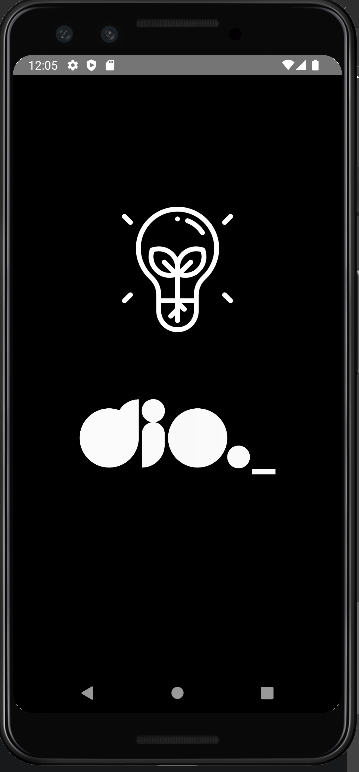

# Light Shake

<p>
  
  
  <a href="https://github.com/leandrolid/light-shake/commits/main">
    
  </a>
</p>

## Tópicos 

[Preview](#preview)

[Sobre o Light Shake](#sobre-o-light-shake)

[Tecnologias](#tecnologias)

[Instalação e uso](#instalação-e-uso)

<br>

## Preview

<p align="center">


</p>

## Sobre o Light Shake 

Essa é a minha versão do projeto desenvolvido no bootcamp da DIO. Se trata de um simples app capaz de ligar e desligar a lanterna do celular quando o usuário clica na tela ou quando o aparelho é balançado.
O app foi feito usando React Native, com o uso do React Native Shake e Torch.

<br>
<br>

## Tecnologias

Tecnologias e ferramentas utilizadas no desenvolvimento do projeto:

- [React Native](https://reactnative.dev/)
- [VS Code](https://code.visualstudio.com/) com [ESLint](https://eslint.org/)

<br>

## Instalação e uso

```bash
# Abra um terminal e copie este repositório com o comando
git clone git@github.com:leandrolid/light-shake.git
# ou use a opção de download.

# Entre na pasta web com 
cd light-shake

# Instale as dependências
npm install

# Faça o bundle para Android ou iOS
npm run android / npm run ios

# Rode o aplicação
npm start

# Acesse http://localhost:3000 no seu navagador.
```

<br>

Esse projeto está sob a licença MIT. Veja o arquivo [LICENSE](/LICENSE) para mais detalhes.

---

Feito com :purple_heart: by [Leandro Liduvino](https://github.com/leandrolid)
